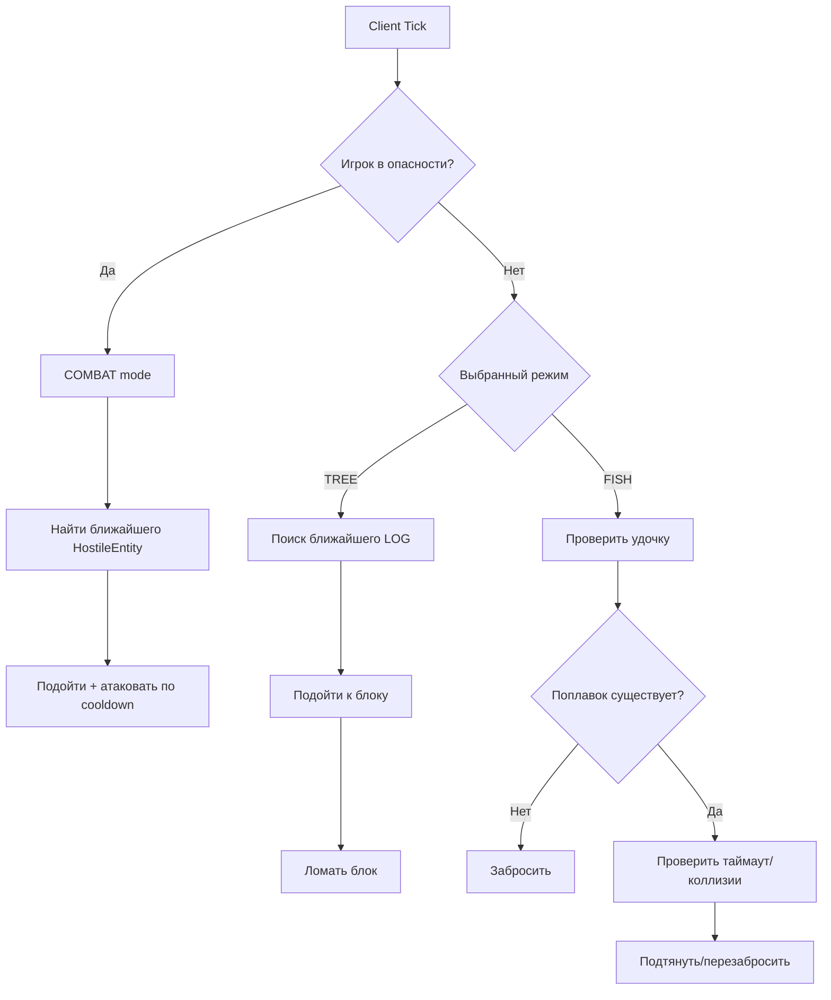
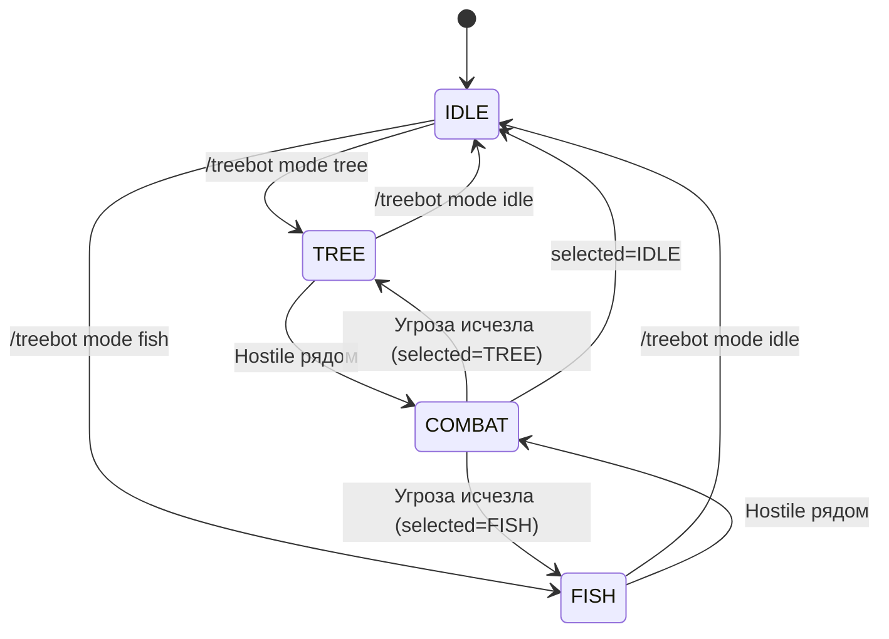

<div align="center">

# 🌲🤖 TreeBot MC

[](https://www.minecraft.net/)
[](https://fabricmc.net/)
[](https://adoptium.net/)
[](./LICENSE)

**Автоматический бот для Fabric 1.21.4:**
`🌲 рубит дерево` • `🎣 рыбачит` • `⚔️ защищается от мобов`

</div>

---

## ✨ Что умеет мод

TreeBot MC — это **клиентский мод**, который работает как конечный автомат состояний:

- **TREE mode** — ищет ближайшие блоки логов и рубит их.
- **FISH mode** — автоматически забрасывает и подтягивает удочку.
- **COMBAT override** — если рядом опасные мобы, бот временно переходит в боевой режим.
- После исчезновения угрозы бот возвращается в выбранный режим (`TREE` / `FISH`).

> ⚠️ Важно: мод не заменяет полноценный pathfinding AI (например Baritone), а использует легковесную логику движения/целей.

---

> ℹ️ Для совместимости с инструментами автосоздания PR в репозитории используются только текстовые файлы (без бинарных ассетов).

## 🧭 Команды

```bash
/treebot mode idle
/treebot mode tree
/treebot mode fish
/treebot status
```

- `idle` — остановить бота.
- `tree` — включить рубку деревьев.
- `fish` — включить рыбалку.
- `status` — посмотреть выбранный и текущий runtime-режим.

---

## 🏗️ Архитектура



### Модель состояний



---

## 📁 Структура проекта

```text
src/
├─ client/java/com/treebot/
│  ├─ TreeBotClient.java   # Основная логика FSM + команды + tick обработка
│  └─ BotMode.java         # Режимы работы
└─ main/resources/
   ├─ fabric.mod.json      # Метаданные Fabric-мода
```

---

## 🚀 Быстрый старт (разработчик)

### 1) Требования
- Java 21
- Gradle 8+
- Minecraft 1.21.4

### 2) Сборка

```bash
gradle build
```

### 3) Запуск dev-клиента

```bash
gradle runClient
```

---

## 🔬 Принципы работы

### 1. Контроль опасности
Каждый тик бот сканирует радиус угроз и ищет `HostileEntity`.
Если угроза найдена — **приоритетно** запускается `COMBAT`.

### 2. Рубка дерева
- Поиск ближайшего блока из `BlockTags.LOGS`.
- Поворот камеры к цели.
- Подход к блоку, если далеко.
- Ломание блока через `updateBlockBreakingProgress`.

### 3. Рыбалка
- Проверка удочки в руке.
- Заброс, если поплавка нет.
- Подтягивание по таймауту/событиям коллизии.

### 4. Боевой режим
- Выбор ближайшего hostile-моба.
- Поворот камеры в цель.
- Подход в радиус удара.
- Удар с учетом attack cooldown.

---

## ⚠️ Ограничения текущей версии

- Нет продвинутого обхода препятствий (ступенек, воды, заборов, caves).
- Рыбалка реализована эвристически (таймер/состояние поплавка), без анализа частиц поклевки.
- Нет GUI-настроек, только команды.

---

## 🛣️ Идеи для развития

- Конфиг с радиусами, таймингами и whitelist/blacklist мобов.
- Интеграция с Baritone для pathfinding.
- HUD-индикатор текущего состояния и цели.
- Логика авто-еды, ремонта, возврата домой.

---

## 📜 Лицензия

MIT — см. файл [LICENSE](./LICENSE).

---

<div align="center">

Сделано с ❤️ для экспериментов с автоматизацией на Fabric.

</div>
